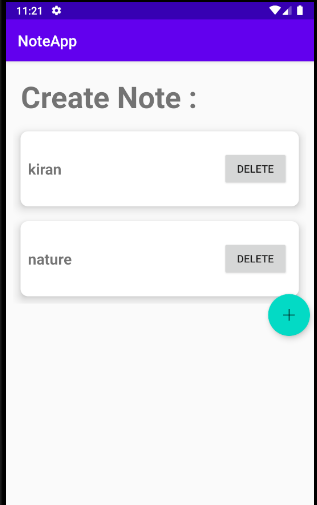
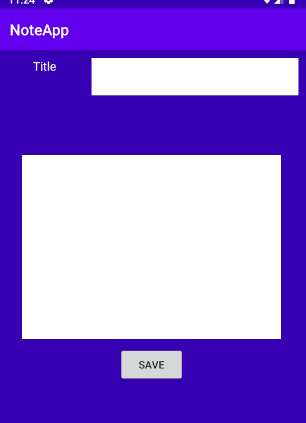
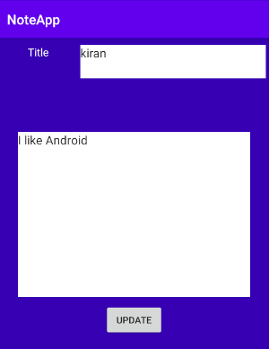

# Note Taking App

## Description
This is a simple demonstration of an app that allows you to create note, view notes, update the note and delete the note. The app follows MVVM architecture pattern. Room library is used for database and Rxjava2 is used to make database call. I have also added repository pattern as an abstract layer so that viewmodel doesn't have to know where data comes from. 

The main activity displays list of notes in recycler view which also has delete button besides.
* 

The floating action button in main activity allows user to create note when its clicked.
* 

User can update the note by clicking on the list of note.    
* 

